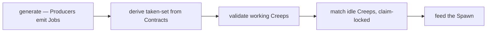
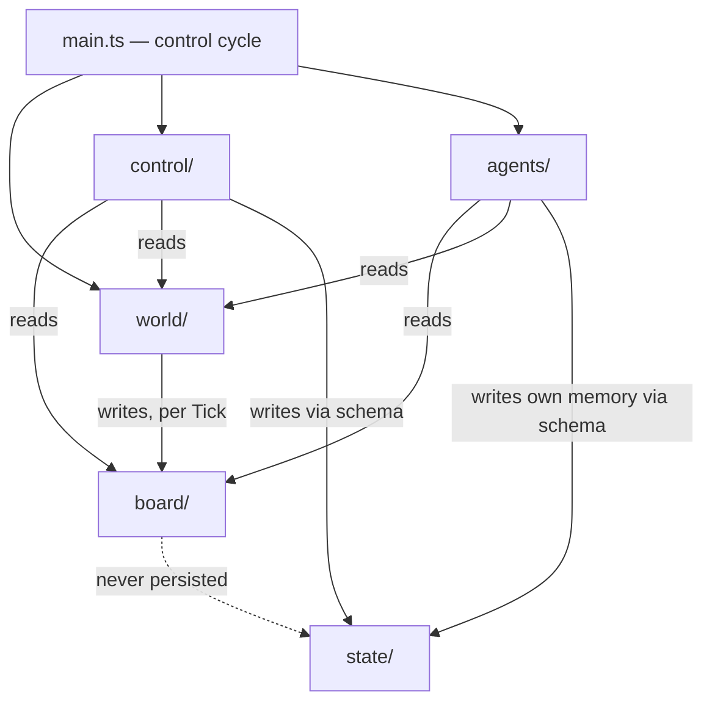

# Architecture Spine — screeps_ai

## Design Paradigm

**Blackboard.** Knowledge sources (`world/`) post the work they sense onto a shared workspace (`board/`), rebuilt from world state every Tick. Control (`control/`) reads the Board and writes Contracts; executors (`agents/`) act on Contracts alone. `main.ts` runs the control cycle — exactly one pass per Tick:



## Invariants & Rules

### AD-1 — Blackboard module roles
- **Binds:** all modules
- **Prevents:** role scatter — Matching logic inside behaviors, Producers calling control, executors posting Jobs
- **Rule:** every module takes exactly one role — `world/` (knowledge sources), `board/` (workspace), `control/` (Matching, Spawn, Evolution), `agents/` (executors), `state/` (schemas). A new capability is a new file inside a role directory, never a cross-role module. Dependencies flow one way: `world/` writes `board/`; `control/` and `agents/` read `world/` and `board/`; nothing calls `control/`.

### AD-2 — Reads are free; writes are owned
- **Binds:** all modules
- **Prevents:** two writers of one entity — double Contract writes, Board edits outside `world/`, shared mutable state
- **Rule:** `world/` and `board/` are read-only to consumers. Field-level write ownership: only `world/` regenerates the Board (per Tick); only `control/` **sets** Contracts — at spawn via `spawnCreep` initial memory, at claim via Matching — and makes spawn decisions; `agents/` write only their own `creep.memory.move` (the engine owns `._move`); a Creep's own validator may **clear** its Contract when invalid (FR-9), never set one; `state/` defines schemas and (de)serialization and holds no business logic.

### AD-3 — Board is a per-Tick derived projection
- **Binds:** `world/`, `board/` (FR-1, FR-2, FR-3)
- **Prevents:** persisted Boards, cleanup code, drift between Board and world
- **Rule:** the Board is recomputed from world state every Tick; no Board data survives the Tick; nothing references a previous Tick's Board. A Producer emits one Job per world object that needs work (FR-2) — never aggregate Jobs.

### AD-4 — Contract shape and Job id grammar
- **Binds:** `agents/`, `control/`, `state/` (FR-3, FR-7..FR-10, FR-19)
- **Prevents:** divergent Contract shapes; denormalized fields drifting from the Board; Board-coupled validation
- **Rule:** `creep.memory.contract` is exactly one string — the jobId `type:targetId`. Validators parse type and targetId from the id and check the live object via `world/` reads. Validators clear a Contract only on FR-9 invalidity (target gone, need met, Creep incapable, TTL insufficient) — never on carry state. Sourcing phase is derived, never stored: source iff empty, serve otherwise.

### AD-5 — Zero colony-level persistence [ADOPTED]
- **Binds:** `state/`, `control/` (FR-27, NFR-2, NFR-3)
- **Prevents:** remembered truth disagreeing with the world — stale era latches, phantom spawn queues
- **Rule:** no Memory keys outside `Memory.creeps`. Era, spawn demand, and population are derived from world state every Tick — degrade, don't remember. **Era is derived inside `world/`** (a pure function of RCL, Extensions, Containers) and exposed on the snapshot; `control/evolution` only consumes it — Producers never call control (AD-1 holds). Producers read era from the snapshot; the mine Producer emits only when era = Specialist (FR-26). Revisit only via spine update.

### AD-6 — Volatile caches live on global and rebuild lazily
- **Binds:** any cache (the distance service first) (NFR-2)
- **Prevents:** recomputable data taxed into Memory; crashes when the isolate resets `global`
- **Rule:** caches live on `global`, are lazily rebuildable from world state on any Tick, and are never written to Memory. Never cache Game object references — objects refresh every Tick; cache ids and plain data only.

### AD-7 — No pathfinding in the scoring path [ADOPTED]
- **Binds:** `control/` (Matching), `world/` (distance service) (FR-11, FR-24, NFR-1)
- **Prevents:** PathFinder/findPath calls inside Matching — the per-Tick CPU bomb; divergent distance logic across modules; within-type precedence that can only be expressed as special-case code
- **Rule:** Matching obtains all distances from the single `world/` distance service. MVP implementation: `RoomPosition.getRangeTo` (Chebyshev). Assignment ordering is **tier → within-tier priority → distance**: every Job carries a within-tier priority set by its Producer from the policy table — this makes FR-24 (Container-first construction) data, not a code path. Real-path costs and route caches are Deferred.

### AD-8 — Single movement choke point with per-Creep stuck escalation [ADOPTED]
- **Binds:** `agents/` (NFR-1)
- **Prevents:** per-behavior move-option divergence; an N-file rewrite when owned routing arrives
- **Rule:** every move goes through the one movement helper (`moveTo` with explicit opts). No behavior calls `move`/`moveTo`/`moveByPath` directly. Stuck := position unchanged for N consecutive Ticks AND `fatigue == 0` → one re-path with `ignoreCreeps: true`, then revert to default opts. `creep.memory.move = { lastPos (packed y*50+x), stuck }`. N and the moveTo opts are MVP constants in `src/config.ts`.

### AD-9 — Control-cycle order is fixed
- **Binds:** `main.ts` (FR-9, FR-10, FR-13)
- **Prevents:** matching against stale capacity (validate must precede match); spawn decisions before the Tick's demand is known
- **Rule:** exactly one pass per Tick, in order: generate → taken-set → validate → match → spawn. The taken-set is derived in `main.ts` during the cycle and passed to validate and match; it is never stored. The taken-set derives from **all** Creeps' Contracts — including Creeps still Spawning, whose Reserved Contracts were written at `spawnCreep` — otherwise a Reserved slot looks vacant and Spawn double-queues (FR-16, FR-29).

### AD-10 — Game reads only through world/
- **Binds:** all modules (NFR-1; test strategy)
- **Prevents:** scattered `find`/`look`/`getObjectById` calls — uncacheable, unmetered, unmockable; unit tests forced to mock the entire Game API
- **Rule:** Game API reads exist only inside `world/`, which exposes the per-Tick snapshot and read API; consumers — including validators — never touch the Game read API directly. Actions (intents) are issued on object references obtained from `world/`: Creep intents (harvest, build, transfer, upgrade, moveTo, …) by `agents/`; the `spawnCreep` intent by `control/spawn`, with initial memory per AD-2 field ownership.



## Consistency Conventions

| Concern | Convention |
| --- | --- |
| Naming | Job ids `type:targetId`; one Producer per file `world/producers/<jobType>.ts`; one behavior per Job type `agents/behaviors/<jobType>.ts`; directories = blackboard roles |
| Data & formats | Contract = jobId string; `creep.memory = { contract, move, _move(engine) }`; Job = `{ id, type, targetId, pos, tier, withinTierPriority, maxWorkers, assignmentMode, lifetimeClass, requirements { body, ttlFloor } }`; JobType and friends as string-union types, not runtime enums; `strict` TypeScript |
| State & mutation | ownership per AD-2; colony Memory forbidden per AD-5; action return codes (`ERR_*`) checked at the callsite; no exceptions across the control cycle |
| Config | everything tunable lives typed in `src/config.ts`: the **policy table** (Priority Tier, within-tier priority, maxWorkers, Reserved-vs-Pulled per Job type — FR-22's one-place policy change; `mine: 1` at MVP), the **MVP constants** (target population, Collector minimum, TTL *replacement* threshold, per-Job TTL *floors*, stuck N, reusePath), and the **MVP Body compositions** (Generalist / Harvester / Collector). This spine pins names and types; values are pinned at the first story that uses them. Matching never offers Reserved Jobs to idle Creeps (FR-6). Seed of the Phase-3 configurable-strategy surface |
| Creep lifecycle | behaviors implement SPAWNED → SEEKING → WORKING → IDLE → DYING, always derived per AD-4 — never a stored phase; DYING = deliver carried energy to the nearest needy structure, then idle |
| Observability (dev) | per-phase CPU metering via `Game.cpu.getUsed()` behind a `config.ts` flag, reported through the logging convention; a sim-room CPU observation window is part of the MVP-exit check (SM-1/SM-C1) |
| Build | esbuild bundles `src/main.ts` → `dist/main.js`: single file, CJS format, `target=es2022`, no minification or sourcemaps in dev — target verified against the live shard at first build |
| Logging | `console` only, prefixed by module (`[matching] …`); no framework |

## Stack

| Name | Version |
| --- | --- |
| Node.js (toolchain only) | 24 LTS (floor ≥22.13) |
| typescript | 7.0.2 |
| esbuild | 0.28.1 |
| @types/screeps | 3.4.0 |
| vitest | 4.1.10 |
| @biomejs/biome | 2.5.7 |
| screeps-api | 2.1.0 |

All versions verified against the npm registry on 2026-08-07 (see `.memlog.md`).

## Structural Seed

```text
src/
  main.ts            # the control cycle ONLY (AD-9)
  config.ts          # typed MVP constants
  world/             # snapshot + Game reads + era derivation + distance service (AD-10, AD-5, AD-7)
    producers/       # one file per Job type: mine.ts, fill.ts, build.ts, upgrade.ts
  board/             # Job + Contract types; the per-Tick registry (AD-3)
  control/
    matching.ts      # scoring + claim lock (AD-7)
    spawn.ts         # population, proactive replacement, reserved slots, body selection
    evolution.ts     # era-driven spawn policy (era comes from the world/ snapshot)
  agents/
    behaviors/       # one per Job type: mine.ts, fill.ts, build.ts, upgrade.ts
    movement.ts      # the choke point (AD-8)
    validators.ts    # per-type Contract validation (AD-4)
  state/             # creep.memory schema + (de)serialization guards (AD-2)
test/                # vitest: producers, matching, spawn, evolution, validators vs fake snapshots
scripts/push.ts      # screeps-api deploy
dist/                # esbuild output: main.js
```

Deployment & environments: exactly two — the official simulation room (bundle pasted in; iteration) and the official World shard (`npm run push` via screeps-api; token in a gitignored `screeps.json`). No private server, no external infrastructure. Operations = unattended running plus manual Memory inspection.

## Capability → Architecture Map

| Capability / Area | Lives in | Governed by |
| --- | --- | --- |
| PRD §4.1 Job Board | world/producers + board/ | AD-1, AD-2, AD-3, AD-10 |
| PRD §4.2 Contract Lifecycle | agents/validators + state/ | AD-2, AD-4, AD-5 |
| PRD §4.3 Job Matching | control/matching | AD-2, AD-7, AD-9 |
| PRD §4.4 Spawn Management | control/spawn | AD-2, AD-5, AD-9 |
| PRD §4.5 Generalist Economy | agents/behaviors | AD-1, AD-4, AD-8 |
| PRD §4.6 Evolution | world/ (era derivation) + control/evolution (spawn policy) | AD-2, AD-5 |
| PRD §4.7 Specialist Economy | agents/behaviors + control/spawn | AD-1, AD-4, AD-8 |
| PRD §4.8 NFR-1..4 | cross-cutting | AD-3, AD-5, AD-6, AD-7, AD-10 |

## Deferred

- Real-path distances, owned routing (`moveByPath`), and route caches — Phase-2 scale (multi-room); RawMemory segments are the sanctioned medium when it arrives (a spine update amending AD-6 — segments are not Memory keys).
- moveTo engine internals (reusePath default, `_move` cache behavior, ignoreCreeps semantics) — verify against the API docs at the movement-helper story; the spine pins explicit opts, not engine defaults.
- Runtime-mutable config (Phase 3 configurable strategy) — arrives with a read-semantics AD (load-time vs per-Tick reads).
- Traffic management beyond per-Creep stuck escalation — Phase 2+.
- Validation/Board throttling (backoff) — Phase-3 configurable-strategy lever.
- Bodies-as-data per energy-capacity band — Phase 2 (see PRD addendum).
- Persistent cost matrices — multi-room only.
- Behavior-level unit tests — rejected for MVP; revisit if a private server is adopted. Behavior-FR acceptance (FR-19, FR-20, FR-28, FR-30) is verified in the sim room at story time.
- `@types/screeps` 3.4.0 under TypeScript 7 — confirm at first build; fallback pin `typescript ~5.9.3` (both verified 2026-08-07).
