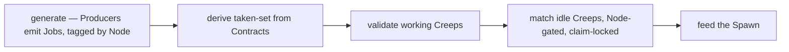
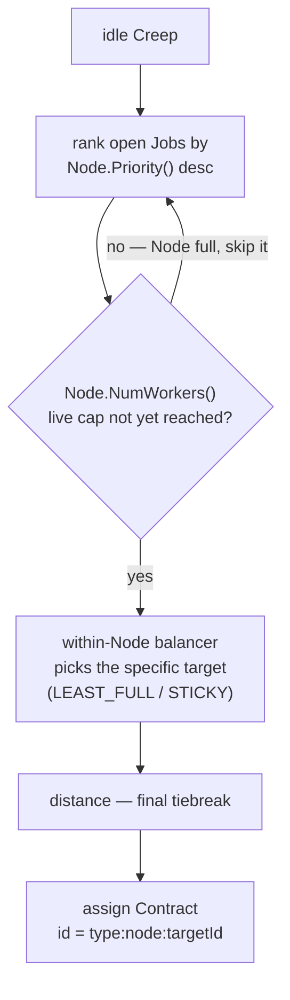
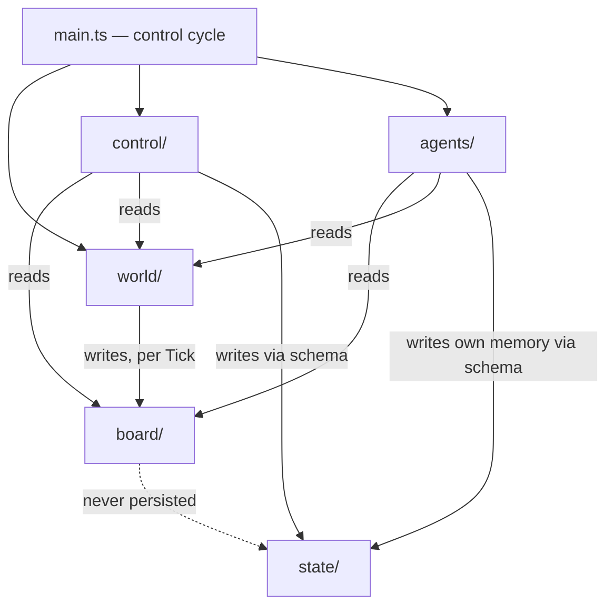

# Architecture Spine — screeps_ai

**Numbering note:** This spine is copied from the previous spine and amended. `AD-1`–`AD-10` are Stage 1 (2026-08-07); `AD-11`–`AD-14` are new for Stage 2 (2026-08-16). Amended ADs keep their original number — the Rule text changed, the id and its Binds/Prevents lineage did not. "S1 FR-N" / "S2 FR-N" disambiguate the two PRDs' independently-numbered requirement sets (each restarts at FR-1).

## Design Paradigm

**Blackboard.** Knowledge sources (`world/`) post the work they sense onto a shared workspace (`board/`), rebuilt from world state every Tick. Control (`control/`) reads the Board and writes Contracts; executors (`agents/`) act on Contracts alone. `main.ts` runs the control cycle — exactly one pass per Tick, unchanged by Stage 2:



**Stage 2 addition — the Node/Pool model.** Stage 2 replaces Stage 1's static, colony-blind `tier → within-tier priority` ranking with a Kubernetes-shaped scheduler: every open Job belongs to a **Node** (a config-defined pool, finer-grained than JobType — e.g. `spawns` and `extensions` are separate Nodes though both are `fill`-type Jobs), and a Node's live `Priority()`/`NumWorkers()` — both plain values or pure functions of world state — govern who gets served and how many workers a Node can ever hold colony-wide.

| Kubernetes concept | screeps_ai concept |
| --- | --- |
| Cluster | Room |
| Node | Producer-pool (per structure-kind — `spawns`, `extensions`, `mines`, …) |
| Kubelet | the Node's Worker Pool — its `NumWorkers()` gate + `balancer` |
| Pod | Worker (Creep) |
| Taint / Toleration | Node taint / body-kind tolerations (AD-13) |
| Control Plane | N/A — implicit in `config.ts` + Matching; no separate module |



## Invariants & Rules

### AD-1 — Blackboard module roles
- **Binds:** all modules
- **Prevents:** role scatter — Matching logic inside behaviors, Producers calling control, executors posting Jobs
- **Rule:** every module takes exactly one role — `world/` (knowledge sources), `board/` (workspace), `control/` (Matching, Spawn, Evolution), `agents/` (executors), `state/` (schemas). A new capability is a new file inside a role directory, never a cross-role module. Dependencies flow one way: `world/` writes `board/`; `control/` and `agents/` read `world/` and `board/`; nothing calls `control/`. Stage 2's Node tag is a new *field* Producers attach per Job — it does not create a new module or a new Producer-per-Node; one Producer file still owns exactly one JobType (AD-11).

### AD-2 — Reads are free; writes are owned
- **Binds:** all modules
- **Prevents:** two writers of one entity — double Contract writes, Board edits outside `world/`, shared mutable state
- **Rule:** `world/` and `board/` are read-only to consumers. Field-level write ownership: only `world/` regenerates the Board (per Tick); only `control/` **sets** Contracts — at spawn via `spawnCreep` initial memory, at claim via Matching — and makes spawn decisions; `agents/` write only their own `creep.memory.move` (the engine owns `._move`); a Creep's own validator may **clear** its Contract when invalid (S1 FR-9), never set one; `state/` defines schemas and (de)serialization and holds no business logic.

### AD-3 — Board is a per-Tick derived projection
- **Binds:** `world/`, `board/` (S1 FR-1, FR-2, FR-3)
- **Prevents:** persisted Boards, cleanup code, drift between Board and world
- **Rule:** the Board is recomputed from world state every Tick; no Board data survives the Tick; nothing references a previous Tick's Board. A Producer emits one Job per world object that needs work (S1 FR-2) — never aggregate Jobs. Unchanged by Stage 2: a structure still gets exactly one Job, now additionally tagged with a `node`.

### AD-4 — Contract shape and Job id grammar [AMENDED — Stage 2]
- **Binds:** `agents/`, `control/`, `state/` (S1 FR-3, FR-7..FR-10, FR-19; S2 FR-8, FR-9)
- **Prevents:** divergent Contract shapes; denormalized fields drifting from the Board; Board-coupled validation; **an energy-delivery path outside Matching invalidating a committed Contract by sniping its target** (new — the Stage 2 thrash risk)
- **Rule:** `creep.memory.contract` is exactly one string — the jobId. **Grammar amended:** `type:node:targetId` (was `type:targetId`) — the `node` segment is the Producer-assigned pool tag (AD-11), which makes per-Node occupancy a live prefix-count over current Contracts each Tick, with no separate lookup table. Validators parse `type`, `node`, and `targetId` from the id and check the live object via `world/` reads. Validators clear a Contract only on S1 FR-9 invalidity (target gone, need met, Creep incapable, TTL insufficient) — never on carry state. **New rule:** any energy-delivery path — not only ordinary behavior execution — must treat a target already carrying a live incoming Contract as spoken for. DYING-unload (and any future non-Matching delivery path) prefers a needy structure with **no** live incoming Contract over one that already has a committed filler, so it never invalidates another creep's Contract mid-flight by sniping its target out from under it. Sourcing phase is derived, never stored: source iff empty, serve otherwise.

### AD-5 — Zero colony-level persistence [AMENDED — Stage 2, ADOPTED]
- **Binds:** `state/`, `control/`, `config.ts` (S1 FR-27, NFR-2, NFR-3; S2 all Node functions)
- **Prevents:** remembered truth disagreeing with the world — stale era latches, phantom spawn queues, cached population targets
- **Rule:** no Memory keys outside `Memory.creeps`. Spawn demand and population targets are derived from world state every Tick — degrade, don't remember. **Stage 1's discrete two-state Era (`generalist`/`specialist`) is retired** (`epic-6-retro-2026-08-16.md`: it structurally blocked graduated/partial specialization) — superseded by Stage 2's continuous per-Node `NumWorkers()`/`Priority()` functions (AD-12). There is no discrete era value anywhere in Stage 2's design; each Node's population target is computed directly and freshly from world state every Tick, carrying the same zero-persistence guarantee Era used to carry alone. A discrete, decorative "current phase" label for console logging only, with zero effect on scheduling, is Deferred — the user wants the option of discrete knobs back later but has no integration path yet; revisit once the continuous functions are live and it's clear whether one earns its keep.

### AD-6 — Volatile caches live on global and rebuild lazily
- **Binds:** any cache (the distance service first) (NFR-2)
- **Prevents:** recomputable data taxed into Memory; crashes when the isolate resets `global`
- **Rule:** caches live on `global`, are lazily rebuildable from world state on any Tick, and are never written to Memory. Never cache Game object references — objects refresh every Tick; cache ids and plain data only. Stage 2 deliberately adds **no** new cache here: Node occupancy and balancer target-selection are recomputed live from Contract counts every Tick (AD-4, AD-7) rather than cached, by design — see the `.memlog.md` A-vs-B mechanism decision.

### AD-7 — No pathfinding in the scoring path; Node-gated priority cascade [AMENDED — Stage 2, ADOPTED]
- **Binds:** `control/` (Matching, and Reserved-mode target selection in `spawn`), `world/` (distance service, Node config functions) (S1 FR-11, FR-24, NFR-1; S2 FR-8, FR-9, FR-11)
- **Prevents:** PathFinder/findPath calls inside Matching — the per-Tick CPU bomb; divergent distance logic across modules; within-type precedence expressible only as special-case code; **one Job type structurally absorbing the whole colony's population regardless of how many individual targets it has open** — the Stage 1 failure documented in `epic-6-retro-2026-08-16.md` (fill starved build; SM-1 contradicted)
- **Rule:** Matching obtains all distances from the single `world/` distance service — `RoomPosition.getRangeTo` (Chebyshev) — **unchanged**: still no pathfinding in scoring. **Ordering amended:** assignment ordering is now **Node Priority → within-Node balancer-selected target → distance** (was `tier → within-tier priority → distance`). A Node's live `NumWorkers()` gates eligibility **colony-wide** — counted via the Job id's `node` prefix (AD-4) against current Contracts, recomputed fresh every Tick, no persisted occupancy state. This is what makes S2 FR-8 (colony-wide pool caps) hold: a saturated Node's Jobs stop being eligible candidates entirely, so population spills over to the next-highest-Priority Node with room, rather than one Node hoarding every idle Creep. `withinTierPriority`'s old job (expressing fine-grained precedence within one Job type, e.g. Container-first — S1 FR-24) is now expressed by **splitting into separate Nodes** with different `Priority` values (e.g. a `containers` Node outranks a generic `build` Node) — the same "precedence is data, not code" property AD-7 always guaranteed, carried forward by a different field. Reserved-mode spawn-time target selection (`control/spawn`) consults the **same** Node config (`Priority`, `NumWorkers`, `balancer`) when choosing which vacant Reserved slot to spawn a Harvester for — one mechanism, two call sites, not a separate spawn-side algorithm. `NumWorkers()` is a hard cap on total headcount for a Node **whether Reserved or Pulled** — `control/spawn` spawns for a vacant Reserved target only while that Node's current headcount is below `NumWorkers()`; it is never a Pulled-only concept a Reserved Node can silently ignore. `Priority` is evaluated **once per Node per Tick**, not once per Job — every Job emitted under a Node in a given Tick carries that Tick's single Node-Priority value, not an independently-computed per-target one (keeps the CPU cost at one function call per Node, not per Job — NFR-1/NFR-3). Real-path costs and route caches remain Deferred.

### AD-8 — Single movement choke point with per-Creep stuck escalation [ADOPTED]
- **Binds:** `agents/` (NFR-1)
- **Prevents:** per-behavior move-option divergence; an N-file rewrite when owned routing arrives
- **Rule:** every move goes through the one movement helper (`moveTo` with explicit opts). No behavior calls `move`/`moveTo`/`moveByPath` directly. Stuck := position unchanged for N consecutive Ticks AND `fatigue == 0` → one re-path with `ignoreCreeps: true`, then revert to default opts. `creep.memory.move = { lastPos (packed y*50+x), stuck }`. N and the moveTo opts are MVP constants in `src/config.ts`. Unaffected by Stage 2.

### AD-9 — Control-cycle order is fixed
- **Binds:** `main.ts` (S1 FR-9, FR-10, FR-13)
- **Prevents:** matching against stale capacity (validate must precede match); spawn decisions before the Tick's demand is known
- **Rule:** exactly one pass per Tick, in order: generate → taken-set → validate → match → spawn. The taken-set is derived in `main.ts` during the cycle and passed to validate and match; it is never stored. The taken-set derives from **all** Creeps' Contracts — including Creeps still Spawning, whose Reserved Contracts were written at `spawnCreep` — otherwise a Reserved slot looks vacant and Spawn double-queues (S1 FR-16, FR-29). Unchanged by Stage 2: Node-gating happens *inside* the existing `match` and `spawn` phases, not as a new phase.

### AD-10 — Game reads only through world/
- **Binds:** all modules (NFR-1; test strategy)
- **Prevents:** scattered `find`/`look`/`getObjectById` calls — uncacheable, unmetered, unmockable; unit tests forced to mock the entire Game API
- **Rule:** Game API reads exist only inside `world/`, which exposes the per-Tick snapshot and read API; consumers — including validators — never touch the Game read API directly. Actions (intents) are issued on object references obtained from `world/`: Creep intents (harvest, build, transfer, upgrade, moveTo, …) by `agents/`; the `spawnCreep` intent by `control/spawn`, with initial memory per AD-2 field ownership. AD-12 extends this discipline into `config.ts` itself.

### AD-11 — Node: a per-Job pool tag, orthogonal to Producer/JobType [NEW — Stage 2]
- **Binds:** `world/producers/*` (all Producers), `board/` (Job shape)
- **Prevents:** one Producer file forking into multiple files to express a finer-grained pool; pool occupancy requiring a separate lookup/join table instead of a live count
- **Rule:** every Job carries a `node` field, assigned by its own Producer per target — e.g. `produceFill` tags spawn-targets `node: "spawns"`, extension-targets `node: "extensions"`. One Producer file still emits exactly one JobType (AD-1 unchanged); `node` subdivides *within* a JobType, it does not create new Producer files or new modules. `node` is part of the Job id grammar (AD-4: `type:node:targetId`). **Node names are a single shared typed union** (`NodeName`, defined once in `board/job.ts` alongside `JobType`) — a Producer tags a Job with a `NodeName`, and the config's per-Node table (AD-12) is keyed by that same union; there is no independent, free-string naming on either side to drift apart. A Job whose `node` has no matching config entry in the active room profile is never eligible — treated as `NumWorkers()` = 0, never a runtime throw (consistent with the no-exceptions-across-the-control-cycle convention).

### AD-12 — Config-supplied functions are pure over a world-state summary only [NEW — Stage 2]
- **Binds:** `config.ts` (successor to `JOB_POLICY_TABLE`), `world/` (must supply the summary), `control/` (calls the functions)
- **Prevents:** `config.ts` calling Game/Memory directly (AD-10 violated by the back door); config functions closing over mutable module state (AD-3/AD-6 statelessness violated); non-deterministic output within the same Tick
- **Rule:** `NumWorkers`, `Priority`, and any other config-supplied function (per Node, per room profile) take **exactly one argument** — an already-derived world-state-summary object sourced from the `world/` snapshot (population, per-structure-type counts, etc.) — and read nothing else: no Game/Memory calls, no closures over mutable state. **The world-state-summary type is defined exactly once, in `world/`** (co-located with the snapshot per AD-1's knowledge-source ownership) and exported for `config.ts` to import — never independently redeclared. This extends AD-10's Game-read discipline into `config.ts`, which was previously pure data with zero logic.

### AD-13 — Taints/tolerations gate Node eligibility alongside body requirements [NEW — Stage 2]
- **Binds:** `world/producers/*` (Node config), `control/` (Matching, spawn), `state/` (body-kind config)
- **Prevents:** a specialist role's Node silently accepting any body (defeats the point of specialization); a generalist body getting wrongly excluded from Nodes it should still be able to serve
- **Rule:** a Node carries a small taint tag (e.g. `FILLER`, `WORKER`); each body-kind's config carries a `tolerations` list (the generalist body tolerates every known taint; a specialist body's tolerations list only its own). A candidate is eligible for a Node only if its body-kind's tolerations include the Node's taint — checked **alongside**, not instead of, existing body/requirements eligibility (AD-4).

### AD-14 — Local private server is a third deploy target, not a design surface [NEW — Stage 2]
- **Binds:** none in `src/` — deployment/environment only
- **Prevents:** local-server support leaking new persistence or a second code path into the bot itself; the bot behaving differently depending on which environment it's running in
- **Rule:** `screeps-launcher` (verified `v1.17.0`, GitHub `screepers/screeps-launcher`, adds Node 24 support — compatible with the existing Node 24 LTS pin; wraps the `screeps` private-server engine package, verified `~v4.3.0` on npm as of this check) is a third deploy target alongside the sim room and the official World shard — same `dist/main.js` build artifact, same `config.ts`, zero bot-code branching on which environment it's running in. It introduces no new persistence and does not weaken AD-5/AD-6. Amends the Structural Seed's "Deployment & environments" line below (was: exactly two, no private server).



## Consistency Conventions

| Concern | Convention |
| --- | --- |
| Naming | Job ids `type:node:targetId` (amended — was `type:targetId`); one Producer per file `world/producers/<jobType>.ts`; a Producer may emit Jobs under several `node`s (AD-11); one behavior per Job type `agents/behaviors/<jobType>.ts`; directories = blackboard roles |
| Data & formats | Contract = jobId string; `creep.memory = { contract, move, _move(engine) }`; Job = `{ id, type, node, targetId, pos, priority, maxWorkers, assignmentMode, lifetimeClass, requirements { body, ttlFloor } }` — `node`+`priority` replace Stage 1's `tier`+`withinTierPriority` (AD-7, AD-11); `priority` reuses Stage 1's existing `PriorityTier` union (`critical`\|`high`\|`medium`\|`low`), now a per-Node, potentially per-Tick value instead of a static per-Job one; `maxWorkers` stays a **per-target** cap, distinct from a Node's colony-wide `NumWorkers()` (AD-7); JobType and friends as string-union types, not runtime enums; `strict` TypeScript |
| State & mutation | ownership per AD-2; colony Memory forbidden per AD-5; action return codes (`ERR_*`) checked at the callsite; no exceptions across the control cycle |
| Config | everything tunable lives typed in `src/config.ts`. **Amended (Stage 2):** the flat `JOB_POLICY_TABLE` is superseded by a per-room, per-Node config: `{ <roomProfile>: { <nodeName>: { NumWorkers: fn(worldSummary)->number \| number, Priority: fn(worldSummary)->PriorityTier \| PriorityTier, taint: string, balancer: "LEAST_FULL" \| "STICKY", body, lifetimeClass, requirements } } }`. `NumWorkers`/`Priority` functions are pure over a world-state-summary argument only (AD-12). Multi-room profiles (e.g. a `WarRoom` variant) are shaped-for but not built — Stage 2 needs exactly one default profile (S2 PRD Non-Goals: no multi-room support). Burstiness (S2 FR-10) is **not** a separate structure — it is `NumWorkers()` itself spiking under a condition. Matching never offers Reserved Jobs to idle Creeps (S1 FR-6). Runtime hot-reload without a rebuild/push remains Deferred (S2 PRD confirmed redeploy-per-change is acceptable) |
| Creep lifecycle | behaviors implement SPAWNED → SEEKING → WORKING → IDLE → DYING, always derived per AD-4 — never a stored phase; DYING = deliver carried energy to the nearest needy structure **that carries no live incoming Contract** (AD-4 amendment), then idle |
| Observability (dev) | per-phase CPU metering via `Game.cpu.getUsed()` behind a `config.ts` flag, reported through the logging convention; a sim-room CPU observation window is part of the MVP-exit check (S1 SM-1/SM-C1); Stage 2's local server (AD-14) makes a *fast* CPU-observation loop possible for the first time — still manual, not automated (S2 PRD Non-Goals) |
| Build | esbuild bundles `src/main.ts` → `dist/main.js`: single file, CJS format, `target=es2022`, no minification or sourcemaps in dev — target verified against the live shard at first build. **Deploy targets now three** (AD-14): sim room, local `screeps-launcher` server, official World shard — same artifact, same script family, different push profile |
| Logging | `console` only, prefixed by module (`[matching] …`); no framework |

## Stack

| Name | Version |
| --- | --- |
| Node.js (toolchain only) | 24 LTS (floor ≥22.13) |
| typescript | 7.0.2 |
| esbuild | 0.28.1 |
| @types/screeps | 3.4.0 |
| vitest | 4.1.10 |
| @biomejs/biome | 2.5.7 |
| screeps-api | 2.1.0 |
| screeps-launcher (new, Stage 2, AD-14) | 1.17.0 |
| screeps (private-server engine, pulled in by the launcher) | ~4.3.0 |

Stage 1 rows verified against the npm registry on 2026-08-07 (see `.memlog.md`). The two new Stage 2 rows verified on 2026-08-16: `screeps-launcher` v1.17.0 (GitHub `screepers/screeps-launcher` releases, added Node 24 support — confirmed compatible with the existing Node 24 LTS pin above) and `screeps` ~v4.3.0 (npm registry).

## Structural Seed

```text
src/
  main.ts            # the control cycle ONLY (AD-9)
  config.ts           # typed constants + Stage 2 per-Node config functions (AD-12)
  world/              # snapshot + Game reads + distance service (AD-10, AD-7); world-state summary for config functions derives from the existing snapshot, no new module
    producers/        # one file per Job type: mine.ts, fill.ts, build.ts, upgrade.ts — each tags Jobs with a node (AD-11)
  board/              # Job + Contract types; the per-Tick registry (AD-3); Job.node + Job.priority (AD-11, AD-7)
  control/
    matching.ts       # scoring + claim lock; Node Priority -> balancer -> distance (AD-7)
    spawn.ts          # population, proactive replacement, reserved slots (consults Node config's balancer for target selection — AD-7), body selection
    evolution.ts       # retired as a discrete era gate (AD-5); Node-driven spawn demand now lives alongside spawn.ts
  agents/
    behaviors/         # one per Job type: mine.ts, fill.ts, build.ts, upgrade.ts; dying.ts respects live Contract commitments (AD-4)
    movement.ts        # the choke point (AD-8)
    validators.ts      # per-type Contract validation, parses type:node:targetId (AD-4)
  state/               # creep.memory schema + (de)serialization guards (AD-2)
test/                  # vitest: producers, matching, spawn, validators vs fake snapshots
scripts/push.ts        # screeps-api deploy — gains a local-server push profile (AD-14)
screeps-launcher/       # local private-server config (launcher.yml or equivalent) — new, Stage 2
dist/                   # esbuild output: main.js
```

Deployment & environments [AMENDED — Stage 2]: **three** — the local `screeps-launcher` private server (fast iteration, AD-14), the official simulation room (bundle pasted in), and the official World shard (`npm run push` via screeps-api; token in a gitignored `screeps.json`). No other external infrastructure. Operations = unattended running plus manual Memory inspection.

## Capability → Architecture Map

| Capability / Area | Lives in | Governed by |
| --- | --- | --- |
| S1 PRD §4.1 Job Board | world/producers + board/ | AD-1, AD-2, AD-3, AD-10, AD-11 |
| S1 PRD §4.2 Contract Lifecycle | agents/validators + state/ | AD-2, AD-4, AD-5 |
| S1 PRD §4.3 Job Matching | control/matching | AD-2, AD-7, AD-9 |
| S1 PRD §4.4 Spawn Management | control/spawn | AD-2, AD-5, AD-9 |
| S1 PRD §4.5 Generalist Economy | agents/behaviors | AD-1, AD-4, AD-8 |
| S1 PRD §4.6 Evolution | superseded — see S2 rows below | AD-5 (amended) |
| S1 PRD §4.7 Specialist Economy | agents/behaviors + control/spawn | AD-1, AD-4, AD-8 |
| S1 PRD §4.8 NFR-1..4 | cross-cutting | AD-3, AD-5, AD-6, AD-7, AD-10 |
| S2 PRD §4.1 FR-1..5 Local Dev Server | deployment scripts + `screeps-launcher/` config | AD-14 |
| S2 PRD §4.2 FR-6,7,12 Workforce graduation (continuous, not a discrete ladder) | `config.ts` Node functions + `world/` state summary | AD-5 (amended), AD-12 |
| S2 PRD §4.3 FR-8..11 Workforce Pools & Distribution | control/matching (Node-gated cascade) + control/spawn (Reserved target selection) | AD-7 (amended), AD-11, AD-13 |
| S2 PRD §4.4 FR-13 Config Experimentation Surface | config.ts | AD-12 |
| S2 PRD NFR-1..4 | cross-cutting | AD-5, AD-6, AD-12, AD-14 |

## Deferred

- Real-path distances, owned routing (`moveByPath`), and route caches — Phase-2 scale (multi-room); RawMemory segments are the sanctioned medium when it arrives (a spine update amending AD-6 — segments are not Memory keys).
- moveTo engine internals (reusePath default, `_move` cache behavior, ignoreCreeps semantics) — verify against the API docs at the movement-helper story; the spine pins explicit opts, not engine defaults.
- **Behavior-level unit tests** — rejected for MVP; "revisit if a private server is adopted" was the original Stage 1 note, and Stage 2 just adopted one (AD-14). Ripe for revisit now; cross-reference S2 PRD NFR-4 (population-distribution test coverage), which is a story-time test-content decision, not an architectural one, and belongs to `bmad-create-epics-and-stories`.
- Traffic management beyond per-Creep stuck escalation — Phase 2+.
- Validation/Board throttling (backoff) — still a configurable-strategy lever; now naturally expressible as a Node/balancer concern rather than needing its own mechanism.
- Bodies-as-data per energy-capacity band — Phase 2 (see S1 PRD addendum).
- Persistent cost matrices — multi-room only.
- `@types/screeps` 3.4.0 under TypeScript 7 — confirm at first build; fallback pin `typescript ~5.9.3` (both verified 2026-08-07).
- **Discrete stage/phase concept** — dropped from Stage 2's mechanism (AD-5 amendment); the user wants the option of discrete "knobs" back later but has no integration path yet against the continuous-function model. A decorative, non-authoritative "current phase" label for console logging only (zero effect on scheduling) is the lightest version of this, also deferred — revisit once the continuous functions are live.
- **Multi-room profiles** (e.g. a `WarRoom`-style alternate config) — the config shape is keyed by room profile to leave room for this, but Stage 2 itself ships exactly one default profile (S2 PRD Non-Goals: no multi-room support).
- **Runtime-mutable config** (hot-reload without a rebuild/push) — explicitly out of scope for Stage 2 (S2 PRD confirmed redeploy-per-change is an acceptable cost); still arrives, if ever, via a read-semantics AD (load-time vs per-Tick reads).
- **Automated/headless test harness against the local server** — explicitly out of scope for Stage 2 (S2 PRD Non-Goals: manual fast-iteration use only); the local server (AD-14) is the natural target for this later.
