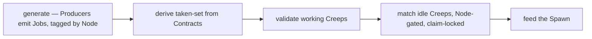
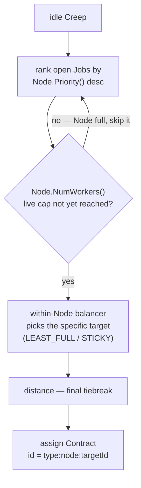
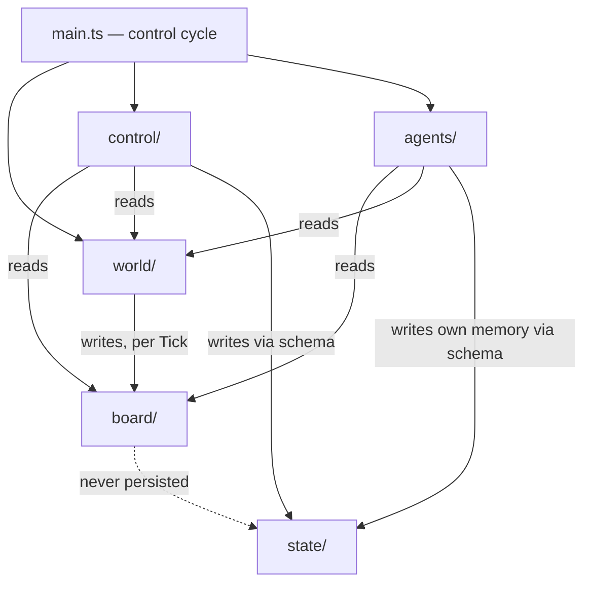

# Architecture Diagrams — screeps_ai

Diagrams for [SPEC.md](SPEC.md) CAP-1, CAP-3, CAP-9. Source: `ARCHITECTURE_SPINE.md`.

## Control cycle (main.ts, one pass per Tick — AD-9)

## Node-gated assignment cascade (AD-7, CAP-3)

## Module dependency flow (AD-1, AD-2)

